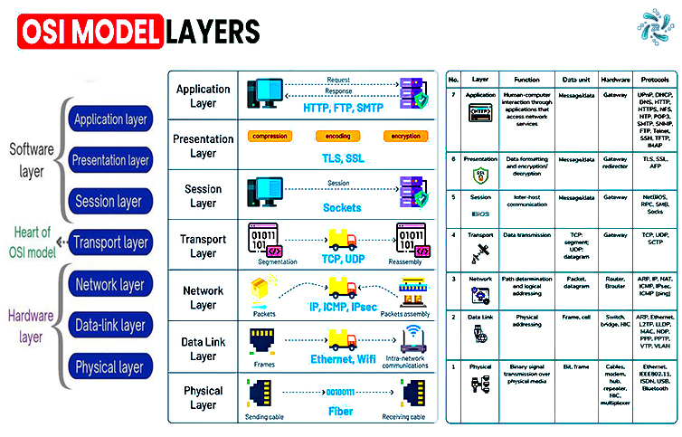
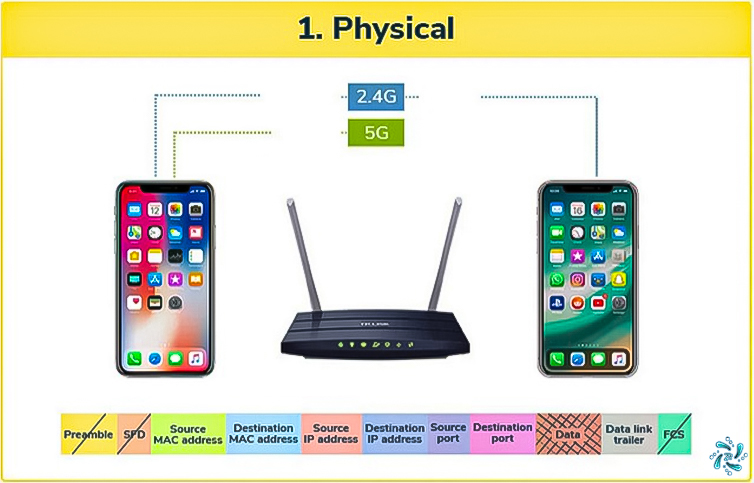
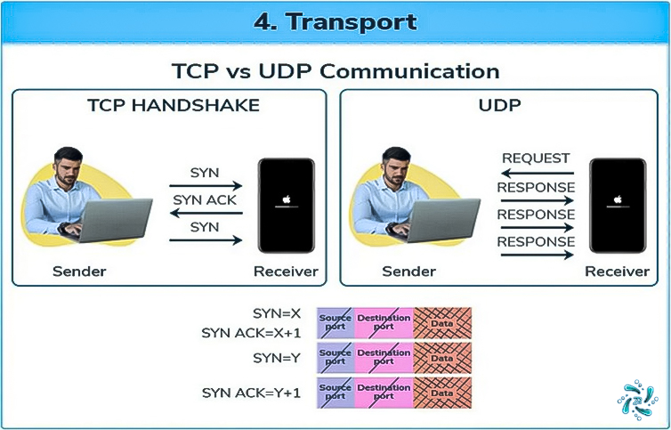
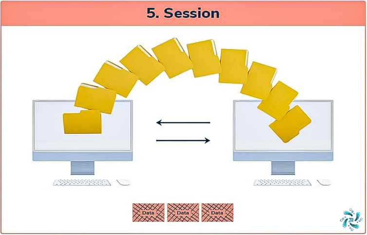
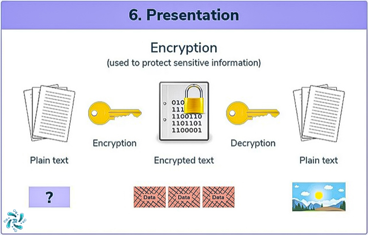
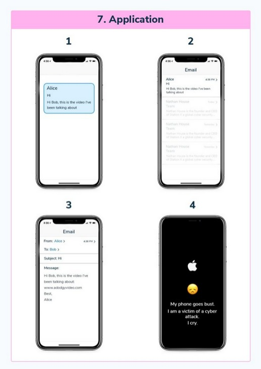

# 📡 OSI Model: The 7 Layers 

## 🌐 Overview
The **Open Systems Interconnection (OSI)** model is a conceptual framework that standardizes the functions of a communication system into seven distinct layers, each serving specific networking functions. This hierarchical approach defines how data is transmitted and received over a network.

---

## 🔄 Layer-by-Layer 

### 7️⃣ Application Layer
**Unit**: Data
#### Key Aspects:
- 🌐 User interface level
- 📨 Email services (SMTP)
- 🔍 Web browsing (HTTP/HTTPS)
- 📂 File transfers (FTP)
- 🔒 Network security

---

### 6️⃣ Presentation Layer
**Unit**: Data
#### Functions:
- 🔐 Encryption/Decryption
- 🗜️ Data compression
- 🔄 Format conversion
- 📝 Character encoding
- 🖼️ Graphics formatting

---

### 5️⃣ Session Layer
**Unit**: Data
#### Responsibilities:
- 🔌 Connection management
- 🔄 Session handling
- 🔑 Authentication
- 🛡️ Authorization
- ⏯️ Dialog control

---

### 4️⃣ Transport Layer
**Unit**: Segments
#### Features:
- ✅ Error checking
- 🔄 Flow control
- 📦 Segmentation
- 🔢 Sequencing
- 📊 Congestion control

---

### 3️⃣ Network Layer
**Unit**: Packets
#### Components:
```plaintext
[Header]
- Source IP: xxx.xxx.xxx.xxx
- Destination IP: xxx.xxx.xxx.xxx
[Segment]
[Data]
```
#### Functions:
- 🗺️ Routing
- 📍 Logical addressing
- 🔄 Path determination

---

### 2️⃣ Data Link Layer
**Unit**: Frames
#### Frame Structure:
```plaintext
[Header]
- Source MAC: XX:XX:XX:XX:XX:XX
- Destination MAC: XX:XX:XX:XX:XX:XX
- Source IP: xxx.xxx.xxx.xxx
- Destination IP: xxx.xxx.xxx.xxx
[Segment]
[Data]
[Trailer]
```
#### Key Features:
- 🔍 Error detection
- 📡 Physical addressing
- 🔄 Flow control

---

### 1️⃣ Physical Layer
**Unit**: Bits (0s and 1s)
#### Characteristics:
- ⚡ Electrical signals
- 🔌 Physical connections
- 📡 Transmission medium
- 🔢 Binary data handling
- 💫 Signal conversion

---

## 📊 Data Flow Visualization
```plaintext
┌──────────────────────┐
│   Application (7)    │ ⟺ Data
├──────────────────────┤
│   Presentation (6)   │ ⟺ Data
├──────────────────────┤
│     Session (5)      │ ⟺ Data
├──────────────────────┤
│    Transport (4)     │ ⟺ Segments
├──────────────────────┤
│     Network (3)      │ ⟺ Packets
├──────────────────────┤
│    Data Link (2)     │ ⟺ Frames
├──────────────────────┤
│    Physical (1)      │ ⟺ Bits
└──────────────────────┘
```

## 🔄 Data Encapsulation Process
1. **Application** → Raw Data
2. **Presentation** → Formatted Data
3. **Session** → Data + Session Info
4. **Transport** → Segments
5. **Network** → Packets
6. **Data Link** → Frames
7. **Physical** → Bits

---

## 🛠️ Common Protocols by Layer

## 7️⃣ Application Layer
- **HTTP/HTTPS**
  - Web browsing and data transfer
  - Hypertext Transfer Protocol
- **FTP/SFTP**
  - File Transfer Protocol
  - Secure File Transfer Protocol
- **SMTP/POP3/IMAP**
  - Email protocols
  - Simple Mail Transfer Protocol
  - Post Office Protocol
  - Internet Message Access Protocol
- **DNS**
  - Domain Name System
  - Name resolution service
- **DHCP**
  - Dynamic Host Configuration Protocol
  - IP address assignment
- **SSH**
  - Secure Shell
  - Encrypted remote access
- **Telnet**
  - Remote access protocol
- **SNMP**
  - Simple Network Management Protocol
  - Network device management

## 6️⃣ Presentation Layer
- **SSL/TLS**
  - Secure Sockets Layer
  - Transport Layer Security
- **Data Formats**
  - JPEG, GIF, PNG (Images)
  - MIDI, MPEG (Multimedia)
- **Character Encoding**
  - ASCII
  - EBCDIC
- **Data Representation**
  - XML
  - JSON

## 5️⃣ Session Layer
- **NetBIOS**
  - Network Basic Input/Output System
- **RPC**
  - Remote Procedure Call
- **PAP**
  - Password Authentication Protocol
- **SDP**
  - Session Description Protocol
- **PPTP**
  - Point-to-Point Tunneling Protocol

## 4️⃣ Transport Layer
- **TCP**
  - Transmission Control Protocol
  - Connection-oriented
  - Reliable delivery
- **UDP**
  - User Datagram Protocol
  - Connectionless
  - Fast delivery
- **SCTP**
  - Stream Control Transmission Protocol
- **SPX**
  - Sequenced Packet Exchange
- **DCCP**
  - Datagram Congestion Control Protocol

## 3️⃣ Network Layer
- **IPv4/IPv6**
  - Internet Protocol versions
- **ICMP**
  - Internet Control Message Protocol
  - Error reporting
- **IGMP**
  - Internet Group Management Protocol
- **IPsec**
  - Internet Protocol Security
- **Routing Protocols**
  - OSPF (Open Shortest Path First)
  - BGP (Border Gateway Protocol)
  - RIP (Routing Information Protocol)

## 2️⃣ Data Link Layer
- **Ethernet**
  - Local area networking
- **Wi-Fi (802.11)**
  - Wireless networking
- **PPP**
  - Point-to-Point Protocol
- **HDLC**
  - High-Level Data Link Control
- **ATM**
  - Asynchronous Transfer Mode
- **Frame Relay**
  - Data packet switching
- **L2TP**
  - Layer 2 Tunneling Protocol

## 1️⃣ Physical Layer
- **RS-232**
  - Serial transmission
- **Ethernet (802.3)**
  - Physical networking standard
- **Bluetooth**
  - Short-range wireless
- **USB**
  - Universal Serial Bus
- **DSL**
  - Digital Subscriber Line
- **ISDN**
  - Integrated Services Digital Network
- **802.11**
  - Wi-Fi physical standards

---

## 📊 Quick Reference Table

| Layer | Key Protocols |
|-------|--------------|
| Application | HTTP, FTP, SMTP, DNS, DHCP |
| Presentation | SSL/TLS, JPEG, MIDI, ASCII |
| Session | NetBIOS, RPC, PAP, SDP |
| Transport | TCP, UDP, SCTP |
| Network | IP, ICMP, IGMP, OSPF |
| Data Link | Ethernet, Wi-Fi, PPP, HDLC |
| Physical | RS-232, USB, DSL, Bluetooth |



```
Each layer is responsible for specific functions and passes data between itself and adjacent layers. This model helps network professionals troubleshoot problems by isolating issues layer by layer.
```
---

## Layer 1: Physical Layer

- **Function:** Transmits raw bits over a physical medium, such as cables or wireless signals.
- **Examples:** Ethernet cables, Wi-Fi signals.
- **Devices:** Hubs, repeaters, cables.
- **Data Transferred:** **Bits**



```
_This layer deals with the physical transmission of data, such as using Ethernet cables or Wi-Fi signals._
```
---

## Layer 2: Data Link Layer

- **Function:** Ensures error-free transfer of data between devices on the same network, using MAC addresses.
- **Examples:** NICs (Network Interface Cards), switches.
- **Devices:** Switches, NICs, MAC addresses.
- **Data Transferred:** **Frames**


```
_The Data Link Layer ensures reliable data transfer within the same network using MAC addresses._
```
---

## Layer 3: Network Layer

- **Function:** Handles routing of data across networks using logical addresses like IP addresses.
- **Examples:** Routers, IP addresses, NAT, ARP.
- **Devices:** Routers.
- **Data Transferred:** **Packets**


```
_The Network Layer uses IP addresses to route data packets across different networks._
```
---

## Layer 4: Transport Layer

- **Function:** Ensures end-to-end communication by segmenting data and providing flow control. It uses protocols like TCP and UDP.
- **Examples:** TCP, UDP.
- **Devices:** Firewalls, routers.
- **Data Transferred:** **Segments**


```
_The Transport Layer manages data segments and ensures reliable communication through protocols like TCP and UDP._
```
---

## Layer 5: Session Layer

- **Function:** Manages sessions between applications, ensuring data flows uninterrupted and correctly sequenced.
- **Examples:** Session ID, port numbers, session management.
- **Devices:** Firewalls.
- **Data Transferred:** **Session data**


```
_The Session Layer ensures proper management of communication sessions between devices._
```
---

## Layer 6: Presentation Layer

- **Function:** Ensures data is in a format the receiving application can understand, including encryption and compression.
- **Examples:** SSL/TLS, data encryption.
- **Devices:** None specific.
- **Data Transferred:** **Data formats (encrypted, compressed)**


```
_The Presentation Layer handles encryption and compression, ensuring secure data transfer._
```
---

## Layer 7: Application Layer

- **Function:** The interface for end-users, where network services and applications interact.
- **Examples:** Web browsers, email clients, APIs.
- **Devices:** PCs, Firewalls, IDS.
- **Data Transferred:** **User data**


```
_The Application Layer is where users interact with network services like web browsers and email clients._
```
---

## OSI Model Layers Overview

| **Layer** | **Name**            | **Function**                                                                                          | **Protocols/Devices**                                         |
|-----------|---------------------|------------------------------------------------------------------------------------------------------|--------------------------------------------------------------|
| **Layer 1** | **Physical**        | Handles the physical transmission of data over a medium.                                              | Ethernet, Wi-Fi, Cables, Hubs, Repeaters                      |
| **Layer 2** | **Data Link**       | Ensures data transfer is error-free between two directly connected nodes, using MAC addresses.       | NIC, Switches, Ethernet, Frame Relay                         |
| **Layer 3** | **Network**         | Routes data packets using IP addresses across networks.                                               | Routers, IP, ARP, NAT, OSPF, IPv4/IPv6                       |
| **Layer 4** | **Transport**       | Manages end-to-end communication, splitting and reassembling data for reliable delivery.             | TCP, UDP, Segments                                            |
| **Layer 5** | **Session**         | Manages sessions and keeps them open or closed between applications.                                 | TCP, UDP, Port Numbers, Session Management                    |
| **Layer 6** | **Presentation**    | Ensures data is in a readable format and handles encryption and compression.                          | SSL/TLS, POP3S, IMAPS, File Compression                       |
| **Layer 7** | **Application**     | Provides the user interface and access to network services.                                          | HTTP, DNS, FTP, Email Clients, APIs                           |

---

## Key Concepts

- **Encapsulation:** Adding headers to data at each layer as it is transmitted.
- **De-encapsulation:** Removing headers at each layer as data is received.

---

### **Summary of the OSI Model**

The **OSI Model** provides a clear framework for understanding how data travels from one device to another, passing through seven layers, each responsible for a specific task. While the OSI model is not directly implemented in real-world networks, it helps engineers and IT professionals troubleshoot network issues by identifying the problematic layer.

