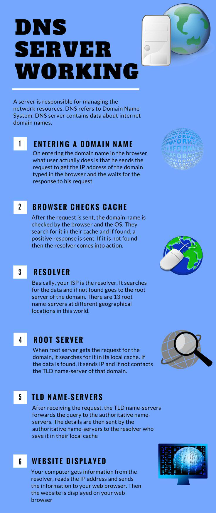
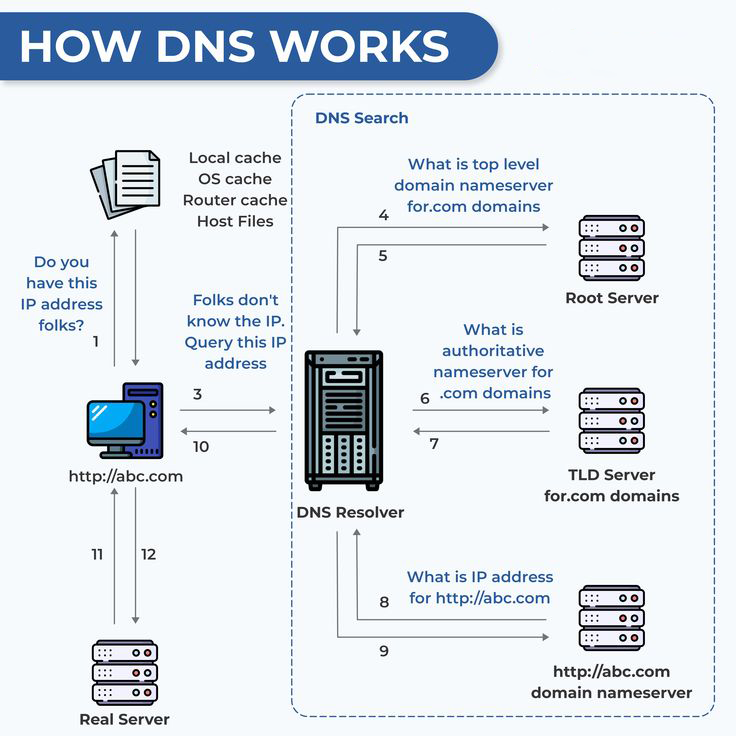
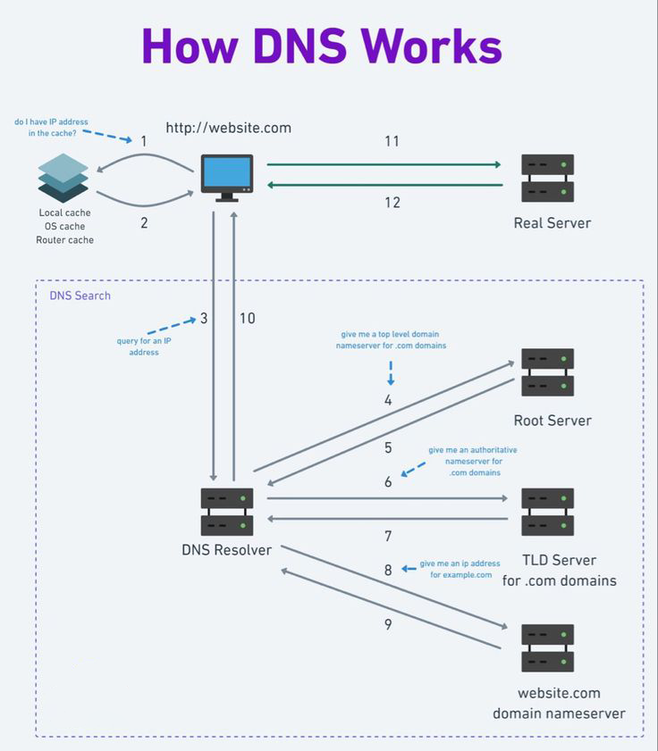
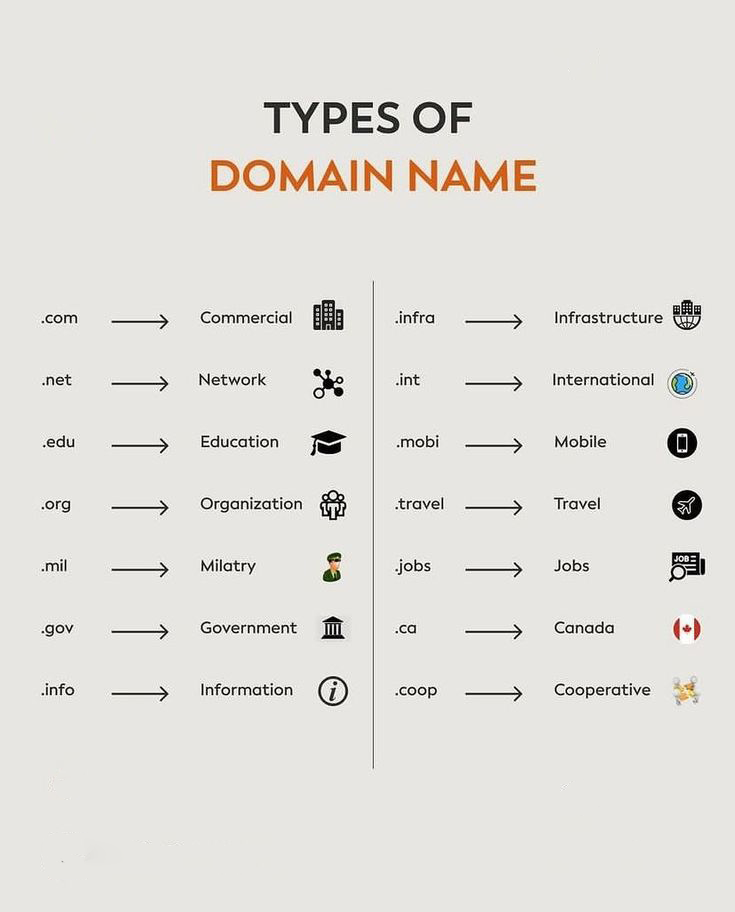

# DNS 

DNS (Domain Name System) translates human-readable domain names (like [invalid URL removed]) into IP addresses that computers use to communicate. It works like a phone book for the internet, storing records in zone files on DNS servers. This allows users to access websites using easy-to-remember names instead of complex numerical addresses.

---

## Key Attributes of DNS

- **Protocol Type**: Application Layer (Layer 7)
- **Purpose**: Name to IP Conversion
- **Standard**: 
  - Current: RFC 1034/1035 (1987)  
  - Original: RFC 882/883 (1983)
- **Structure**: Hierarchical
- **Founder**: Paul V. Mockapetris
- **Carrier Protocol**: TCP, UDP
- **Port**: 
  - TCP 53 (Zone Transfer)
  - UDP 53 (DNS Queries)
- **Model**: Client/Server

---
# DNS Server Working

---

# How DNS work 
DNS is the system responsible for converting domain names like `example.com` into IP addresses like `192.0.2.1`, allowing the browser to access websites.

### DNS Query Process
1. **User  Input**: When you type a domain name (e.g., `example.com`) into your browser, a DNS query is initiated.

2. **Cache Check**: The DNS server checks its cache to see if it already has the corresponding IP address.

3. **Recursive Query**: If the IP address is not cached, the server queries higher-level DNS servers, starting from the root servers down to the authoritative servers for the domain.

4. **Response**: The server eventually retrieves the correct IP address and sends it back to the browser.

5. **Website Access**: The browser uses the IP address to connect to the web server and display the requested website.

---

## Types of Domain Names

1. **Top-Level Domains (TLDs)**: 

   - Examples: `.com`, `.org`, `.gov`, and country-specific ones like `.us`, `.uk`.

2. **Second-Level Domains (SLDs)**: 

   - The part before the TLD, such as `google` in `google.com`.

3. **Subdomains**: 

   - Additional parts of a domain, like `blog.example.com`.

4. **Internationalized Domain Names (IDNs)**: 

   - Domains that include non-Latin characters, such as Arabic or Chinese characters.

---

## DNS Records Components

| **Component** | **Description**                              |
|---------------|----------------------------------------------|
| **Type**      | Record type (A, AAAA, CNAME, MX, TXT, etc.)  |
| **Host**      | Root (@) or subdomain (e.g., www, app, blog) |
| **Value**     | IP (A, AAAA), Domain (CNAME, ALIAS, MX), etc.|
| **Priority**  | Used only for MX records                     |
| **TTL**       | Time to Live - caching duration              |

---

### DNS Record Types 

| **Record Type** | **Description**                                               |
|-----------------|---------------------------------------------------------------|
| **A**           | Maps domain to IPv4 address (`example.com => 192.0.2.1`).    |
| **AAAA**        | Maps domain to IPv6 address (`example.com => ::1`).          |
| **CNAME**       | Maps domain to another domain (`www.example.com => example.com`). |
| **ALIAS**       | Like CNAME but can work at the root domain level.            |
| **TXT**         | Stores arbitrary text data. Used for SPF, verification, etc. |
| **MX**          | Directs emails to a mail server.                             |
| **SRV**         | Specifies location for specific services like VoIP.          |
| **PTR**         | Reverse mapping from IP to domain name.                      |
| **CAA**         | Specifies authorized certificate authorities.                |

---

# Common DNS Record Types

## **1. A Record (Address)**
- **Purpose:** Maps a domain name to an IPv4 address.
- **Example:** `example.com` → `192.168.1.1`
- **Use Case:** Accessing websites with IPv4.

## **2. AAAA Record (Quad A)**
- **Purpose:** Maps a domain name to an IPv6 address.
- **Example:** `example.com` → `::1`
- **Use Case:** Modern devices and networks using IPv6.

## **3. CNAME Record (Canonical Name)**
- **Purpose:** Points one domain to another domain (FQDN to FQDN, not to an IP).
- **Example:** `www.example.com` → `example.com`
- **Use Case:** Simplifies domain management.

## **4. ANAME/ALIAS Record**
- **Purpose:** Points the root of a domain to another domain.
- **Example:** `example.com` → `example.netlify.com`
- **Use Case:** Useful for root domains requiring redirects.

## **5. SOA Record (Start of Authority)**
- **Purpose:** Provides essential domain information, such as administrator contact, and determines how DNS propagates to secondary servers.
- **Use Case:** Essential for domain zone configuration.

## **6. NS Record (Name Server)**
- **Purpose:** Specifies authoritative name servers for a domain or subdomain.
- **Use Case:** Directs queries to the appropriate DNS servers.

## **7. MX Record (Mail Exchange)**
- **Purpose:** Points to mail servers handling email for a domain.
- **Example:** `example.com` → `mail.google.com`
- **Use Case:** Routing email traffic.

## **8. TXT Record (Text)**
- **Purpose:** Stores arbitrary human-readable or machine-readable text.
- **Use Case:** Verification for email (e.g., SPF), domains, and policies.

## **9. SRV Record (Service Record)**
- **Purpose:** Specifies services such as VoIP or instant messaging, defining host and port information.
- **Use Case:** SIP, XMPP protocols.

## **10. PTR Record (Pointer)**
- **Purpose:** A reverse of A/AAAA records; maps IP addresses back to domain names.
- **Example:** `192.168.1.1` → `example.com`
- **Use Case:** Reverse DNS lookup.

## **11. CAA Record (Certification Authority Authorization)**
- **Purpose:** Specifies which Certificate Authorities (CAs) are authorized to issue SSL/TLS certificates for the domain.
- **Use Case:** Enhances domain security.

## **12. Round Robin**
- **Purpose:** Maps a hostname to multiple IP addresses for DNS-based load balancing.
- **Use Case:** Distributes traffic across multiple servers.

---     

## DNS Query Types

### 1. **Recursive Query**
- DNS server resolves the entire query by contacting other servers on behalf of the client.

### 2. **Iterative Query**
- DNS server provides a referral to another DNS server without resolving completely.

### 3. **Inverse Query**
- Maps IP addresses back to domain names (reverse lookup).

---

## **DNS Server Types**

| Server Type           | Description                                     |
|-----------------------|-------------------------------------------------|
| **Authoritative**     | Holds original zone files and answers queries with authoritative data.|
| **Primary Server**    | Full read/write access to manage the zone file.                       |
| **Secondary Server**  | Read-only backup that syncs with the primary server.                  |
| **Non-Authoritative** | 	Relies on cache or queries authoritative servers; does not hold original zone files.                  |
| **Cache-Only**        | Resolves queries using cached data; lacks authoritative zone files.  |

