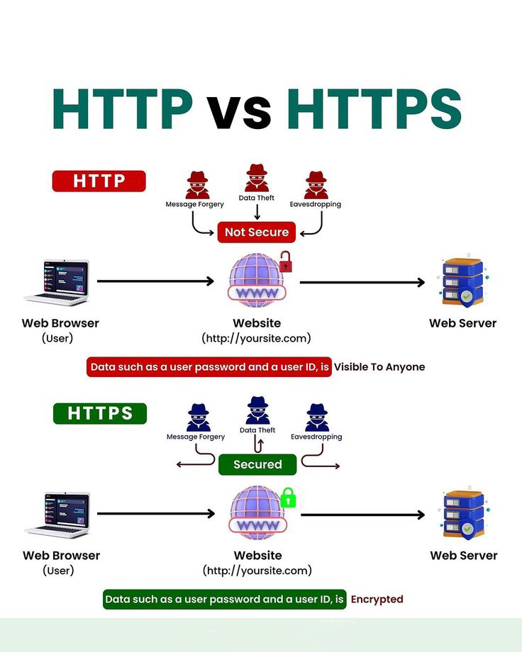
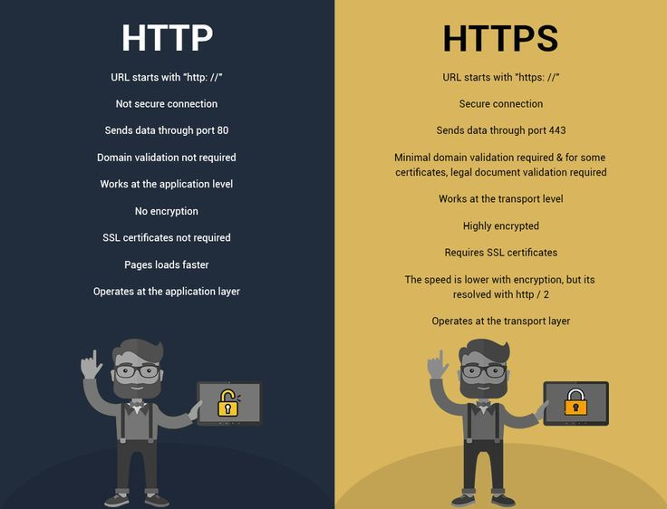
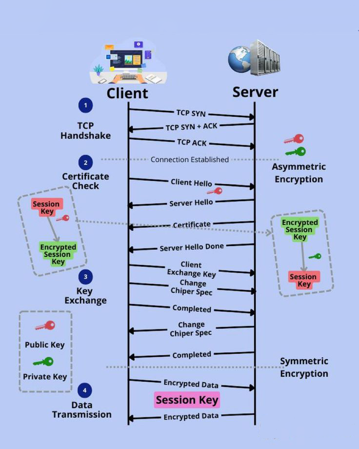
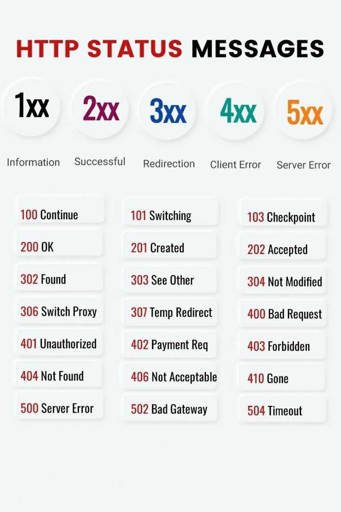
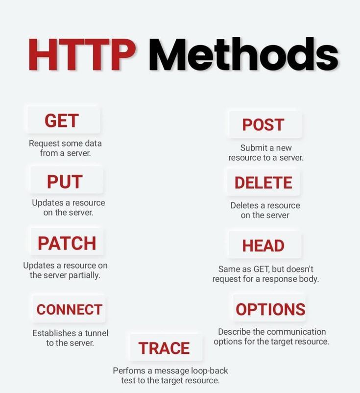
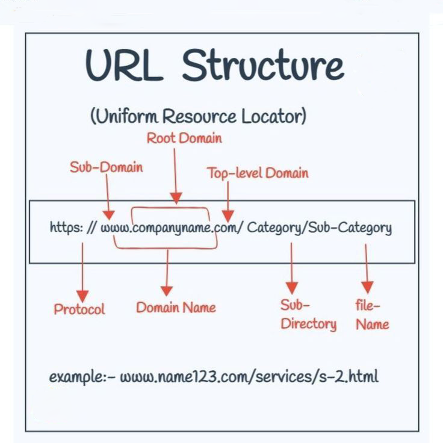

# 🌐 HTTP & HTTPS

## 🎯 Protocol Introduction
### What is HTTP? 📡
HTTP (Hypertext Transfer Protocol) is the foundation of data communication on the World Wide Web. Think of it as the messenger that delivers and receives information between web browsers and servers.




### 🔍 Key Points about HTTP:
```
📡 Communication Protocol
   └── Foundation of web data communication
   └── Plain text data transfer
   └── Allows transfer of various types of data (text, images, videos, etc.)
   └── Works on client-server model
   └── Stateless protocol (each request is independent)
```

### 🛠️ How HTTP Works:


---

### What is HTTPS? 🔒
HTTPS (Hypertext Transfer Protocol Secure) is the secure version of HTTP. It encrypts all communication between the client and server using SSL/TLS protocols.

### 🔒 Key Points about HTTPS:
```
🔐 Secure Protocol
   └── Encrypts all data in transit
   └── SSL/TLS encryption
   └── Prevents man-in-the-middle attacks
   └── Verifies server identity
   └── Required for sensitive data
   └── Data integrity guarantee
```
    
-------------------

## 🔐 Security & Comparison

## 📊 Head-to-Head Comparison Between HTTP vs HTTPS

| Feature | HTTP | HTTPS |
|---------|------|--------|
| Default Port | 80 | 443 |
| Protocol Type |  Application Layer (Layer 7) | Application Layer (HTTP) & Transport Layer (TLS/SSL) |
| Encryption | ❌ No encryption | ✅ SSL/TLS encryption |
| Authentication |  No |Yes, authenticates server and optionally clients too |
| Integrity Checks |  No |	Yes, data is protected from tampering|
| Privacy |  No, data sent in plaintext | Yes, encrypted data is private |
| Security | Very low, no protections built-in | High, resistant to interception and tampering |
| Usage |  Declining, only ~10% of traffic | Dominant protocol, carries ~90% of traffic |
| Caching |  Can cache and reuse unencrypted content | Encrypted content cannot be cached |
| HTTP/2 Support | No | Yes |
| Performance | ⚡ Faster due to no encryption overhead| 🐢  Slower by ~10-30ms higher latency and 5-15% lower throughput|
| SEO Ranking | 📉 Lower | 📈 Higher |
| URL Prefix | http:// | https:// |
| Certificate | Not required | SSL Certificate required |



# Encryption: HTTP vs. HTTPS

The primary distinction between HTTP and HTTPS lies in encryption. While HTTP transmits data in plaintext, HTTPS encrypts the data during transmission, ensuring better security.

## Key Encryption Methods

- **SSL (Secure Sockets Layer)**: 
  - Utilizes asymmetric public-private key encryption.
  - The website possesses a private key to decrypt data sent by the client’s public key.
  - Provides authentication and data privacy.

- **TLS (Transport Layer Security)**: 
  - An upgraded version of SSL.
  - Offers the same encryption capabilities but is more lightweight and efficient.

---

# Integrity

HTTPS provides superior data integrity guarantees compared to HTTP. 

- **HTTP**: Altering data in plaintext traffic is trivial.
- **HTTPS**: Utilizes message authentication codes to verify if the contents have changed during transmission. Any alterations will invalidate the message.

---

# Authentication

- **HTTP**: An unauthenticated protocol, meaning the client does not verify the server's identity and vice versa.
- **HTTPS**: Authenticates the server and sometimes the client, preventing man-in-the-middle (MITM) attacks. 

  - The server presents a digital certificate issued by a certificate authority (CA) like Let’s Encrypt or Comodo.
  - The client verifies this certificate before establishing an encrypted connection.

---

# Privacy

HTTPS offers significantly stronger privacy protections compared to HTTP:

- **HTTP**: No guarantees of privacy; traffic is unencrypted and unauthenticated.
- **HTTPS**: Encrypts data and authenticates endpoints, ensuring user privacy.

---

# Security

HTTPS is inherently more secure than HTTP due to:

- Encryption
- Integrity checks
- Authentication mechanisms

**Recommendation**: Always use HTTPS for sensitive transactions, such as e-commerce purchases, login pages, or account management interfaces.

---

# Usage Trends

Initially, HTTP was more widely used due to its performance advantages. However, security concerns have led to a significant migration to HTTPS:

- As of 2022, HTTPS accounts for approximately **90%** of global internet traffic.
- Legacy HTTP usage has dropped to less than **10%** and continues to decline.

---

# Port Numbers

- **HTTP**: Uses port **80** by default.
- **HTTPS**: Uses port **443**.

This distinction allows web servers to differentiate between HTTP and HTTPS requests easily.

---

# Protocol Overhead

- **HTTPS**: Requires more processing power on the server side for encryption and decryption.
- **HTTP**: Minimal protocol overhead.

This results in additional load on server resources for HTTPS, especially on underpowered servers or those handling high volumes of requests.

---

# Caching

- **HTTP**: The plaintext nature allows intermediate servers and CDNs to efficiently cache and serve frequently accessed static content.
- **HTTPS**: Encrypted data cannot be cached in the same way, requiring all requests to be passed to the origin server.

This results in performance benefits for HTTP, while HTTPS may incur additional latency.

---


### 🔒 How HTTPS Works:
```
1. 👋Client Hello       →  Initiates secure connection
2. 📜Server Response    →  Sends SSL certificate
3. 🔑Key Exchange       →  Establishes encrypted connection
4. 🔒Secure Transfer    →  Data flows securely
```



### Security Deep Dive 🛡️

#### HTTP Vulnerabilities
```
⚠️ Security Risks:
    ❌ Data sent in plain text
    ❌ Vulnerable to eavesdropping
    ❌ No server verification
    ❌ Susceptible to man-in-the-middle attacks
```

#### HTTPS Protection
```
✨ Security Features:
    ✅ Data encryption
    ✅ Server authentication
    ✅ Data integrity
    ✅ Protection against tampering
```
---

## 💫 Advanced Concepts

### Use Case Scenarios 🎯

#### HTTP Best For:
```
📦 Ideal Uses:
   └── Public content
   └── Static resources
   └── Development testing
   └── Non-sensitive data
```

#### HTTPS Essential For:
```
🔒 Critical Uses:
   └── User authentication
   └── Payment processing
   └── Form submissions
   └── Sensitive data
```

### Key Benefits of HTTPS 🌟


### 1. 🛡️ Security Benefits
```
   └── Encrypted communication
   └── Data integrity
   └── Server authentication
``` 

### 2. 🤝 Trust Factors
```
   └── Browser security indicators
   └── Customer confidence
   └── Brand protection
```

### 3. 📈 SEO Advantages
```
   └── Better search rankings
   └── Improved visibility
   └── Higher conversion rates
```

### 4. 🚀 Technical Features
```
   └── Progressive Web Apps support
   └── HTTP/2 support
   └── Modern API access
``` 

---

### Data Flow Comparison 🔄
### HTTP Flow:
```
Client ═══> Plain Text Request  ═══> Server
Server ═══> Plain Text Response ═══> Client
```

### HTTPS Flow:
```
Client ═══> 🔐 Encrypted Request  ═══> Server
Server ═══> 🔐 Encrypted Response ═══> Client
```

-------------------

# **When to Use HTTP** 

Although HTTP presents security vulnerabilities, there are scenarios where it's still valid:

### ✅ **Non-sensitive Websites**  
- Example: Simple marketing website that only showcases **public** information (e.g., blogs, portfolios).

### ✅ **Internal Network/Tools**  
- Use within private systems (e.g., **intranet**, internal dashboards), ensuring **proper firewalling** and **segmentation** from external networks.

### ✅ **IoT Devices**  
- Devices transmitting **non-critical telemetry** data that are limited by **hardware** (e.g., sensors, trackers with low processing capabilities). HTTPS might be impractical due to performance limitations.

### ✅ **Development Stage**  
- The initial phases of development before security implementation, where you're working with **public access** to non-sensitive content (e.g., **API testing**, mock environments).

### ✅ **Redirects to HTTPS**  
- In case of a need to **temporarily redirect** users from HTTP to HTTPS, for example in traffic transition or legacy system migration.

---

# **When to Use HTTPS**

Securing your website and its interactions is essential. Here's when HTTPS should **always** be used:

### ✅ **Public Websites/Apps**  
- Especially those handling **user data** like email addresses, passwords, etc. It encrypts sensitive data ensuring **confidentiality** and **integrity** during transmission.

### ✅ **Ecommerce & Payment Gateways**  
- Secure all transactions, preventing **credit card theft** and protecting **financial data**. HTTPS is vital for trustworthiness in **ecommerce**.

### ✅ **Cloud Apps & Services**  
- For applications transferring **business-critical data**, you **must** use HTTPS to protect this information from MITM (Man-in-the-middle) attacks.

### ✅ **Login & Authentication Pages**  
- **NEVER** use HTTP for user authentication. Protect **credentials** like usernames, passwords, and session tokens during login or registration.

### ✅ **Web Services & APIs**  
- In apps where data exchanges between systems, **ensure encryption of sensitive data**, especially APIs integrated with third parties.

### ✅ **Regulated Industries (Healthcare, Government, Finance)**  
- In sectors dealing with **regulated** data (e.g., healthcare records, tax info), HTTPS isn't optional – it’s **mandated** to ensure compliance.

### ✅ **Private/Confidential Data Input**  
- For any forms or resources where users input private information (e.g., **social security numbers**, **banking details**, etc.).

---

# **Recap - Why HTTPS?**
1. **Encrypts** sensitive data in transit.
2. **Protects** against tampering.
3. **Verifies** website authenticity.
4. **Builds trust** with users. 🌐🔐


-------------------

## 📊 Status Codes



### 1️⃣ 1XX - Informational

- 100 ➜ Continue
- 101 ➜ Switching Protocols
- 102 ➜ Processing
- 103 ➜ Early Hints

### 2️⃣ 2XX - Success

- 200 ✅ OK
- 201 ✨ Created
- 202 👌 Accepted
- 204 📭 No Content
- 206 📑 Partial Content

### 3️⃣ 3XX - Redirection

- 301 📍 Moved Permanently
- 302 🔄 Found
- 304 📝 Not Modified
- 307 ⏳ Temporary Redirect
- 308 🔒 Permanent Redirect

### 4️⃣ 4XX - Client Error

- 400 ❌ Bad Request
- 401 🚫 Unauthorized
- 403 🚷 Forbidden
- 404 🔍 Not Found
- 429 🔥 Too Many Requests

### 5️⃣ 5XX - Server Error

- 500 💥 Internal Server Error
- 502 🌐 Bad Gateway
- 503 🔧 Service Unavailable
- 504 ⌛ Gateway Timeout
- 505 📵 HTTP Version Not Supported

-------------------

## 🛠️ HTTP Methods



### GET 📥
```http
GET /api/users HTTP/1.1
Host: example.com
```
- Retrieves data
- Safe & Idempotent
- Cacheable
- Visible in URL parameters
- Most common method

### POST 📤
```http
POST /api/users HTTP/1.1
Host: example.com
Content-Type: application/json

{
    "name": "John Doe",
    "email": "john@example.com"
}
```
- Creates new resources
- Not safe or idempotent
- Not cacheable
- Data in request body
- Secure for sensitive data

### PUT 🔄
```http
PUT /api/users/1 HTTP/1.1
Host: example.com
Content-Type: application/json

{
    "name": "John Updated",
    "email": "john.updated@example.com"
}
```
- Updates entire resources
- Idempotent
- Complete replacement
- Not safe
- Must include all resource fields

### PATCH 🔧
```http
PATCH /api/users/1 HTTP/1.1
Host: example.com
Content-Type: application/json

{
    "email": "new.email@example.com"
}
```
- Partial resource updates
- Not idempotent
- Modifies specific fields
- More efficient for small changes
- Less bandwidth usage

### DELETE 🗑️
```http
DELETE /api/users/1 HTTP/1.1
Host: example.com
```
- Removes resources
- Idempotent
- Cannot be undone
- May return different status codes
- Should be used carefully

### HEAD 👀
```http
HEAD /api/users HTTP/1.1
Host: example.com
```
- Like GET but headers only
- No response body
- Used for resource validation
- Checks resource existence
- Useful for caching

### OPTIONS 🔍
```http
OPTIONS /api/users HTTP/1.1
Host: example.com
```
- Returns supported methods
- Used for CORS preflight
- Shows server capabilities
- Safe & idempotent
- Help with API discovery

### CONNECT 🔌
```http
CONNECT example.com:443 HTTP/1.1
Host: example.com
```
- Sets up TCP/IP tunnel
- Used for HTTPS through proxy
- Creates end-to-end connection
- Common in proxy servers
- WebSocket establishment

### TRACE 🔬
```http
TRACE /api/path HTTP/1.1
Host: example.com
```
- Debug request path
- Shows request changes
- Diagnostic tool
- Security considerations
- Usually disabled in production

## 📝 Methods Table

| Method    | Safe | Idempotent | Cacheable | Request Body | Response Body |
|-----------|------|------------|-----------|--------------|---------------|
| GET       | ✅   | ✅         | ✅        | ❌          | ✅            |
| POST      | ❌   | ❌         | ❌        | ✅          | ✅            |
| PUT       | ❌   | ✅         | ❌        | ✅          | ✅            |
| PATCH     | ❌   | ❌         | ❌        | ✅          | ✅            |
| DELETE    | ❌   | ✅         | ❌        | ❌          | ✅            |
| HEAD      | ✅   | ✅         | ✅        | ❌          | ❌            |
| OPTIONS   | ✅   | ✅         | ❌        | ❌          | ✅            |
| CONNECT   | ❌   | ❌         | ❌        | ❌          | ✅            |
| TRACE     | ✅   | ✅         | ❌        | ❌          | ✅            |


-------------------

## 🎯 Quick Reference Card

```
📌 Common Status Codes:
200 ✅ - Success
404 🔍 - Not Found
500 💥 - Server Error

📌 All HTTP Methods:
GET    📥 - Retrieve data
POST   📤 - Create new data
PUT    🔄 - Update entire resource
PATCH  🔧 - Update partial data
DELETE 🗑️ - Remove resource
HEAD   👀 - Get headers only
OPTIONS 🔍 - Get available methods
CONNECT 🔌 - Set up TCP tunnel
TRACE  🔬 - Debug request path
```

---

# **Frequently Asked Questions on HTTP vs HTTPS**

---

## Is HTTPS really needed for my website?
> For any public website collecting or transmitting private user data, HTTPS should be considered a mandatory security measure, not an optional extra. The threats posed by unencrypted HTTP traffic are too significant to ignore.

---

## Doesn’t HTTPS impact SEO?
> On the contrary, switching to HTTPS typically improves SEO through positive signals in Google’s ranking algorithm and avoiding browser warnings on HTTP sites. The performance differences are negligible from an SEO standpoint.

---

## How much slower is HTTPS than HTTP?
> Research measuring real-world performance suggests HTTPS adds roughly **10-30ms** higher latency and **5-15%** reduced throughput versus HTTP. This holds page load times back by **500ms or less**. With optimizations, the gap can shrink even further.

---

## Is HTTP faster than HTTPS for image and file transfers?
> Yes, HTTP will outpace HTTPS for the transfer of large assets due to the encryption overhead. But the difference is usually measured in milliseconds and is unlikely to impact user experience.

---

## Can I use HTTP and HTTPS on the same site?
> It’s possible but not advisable. Supporting both protocols splits security across the site, leaving parts of the traffic unprotected. Mixed content warnings may also be triggered. Use redirects or rewrites to unify your site on HTTPS only.

---

## Are there alternatives to HTTPS for better performance?
> Some alternatives like Facebook’s Zero protocol remove TLS handshake overhead by establishing persistent encrypted connections. However, HTTPS remains the standard for public web traffic needing end-to-end security.

---

# URL Structure


