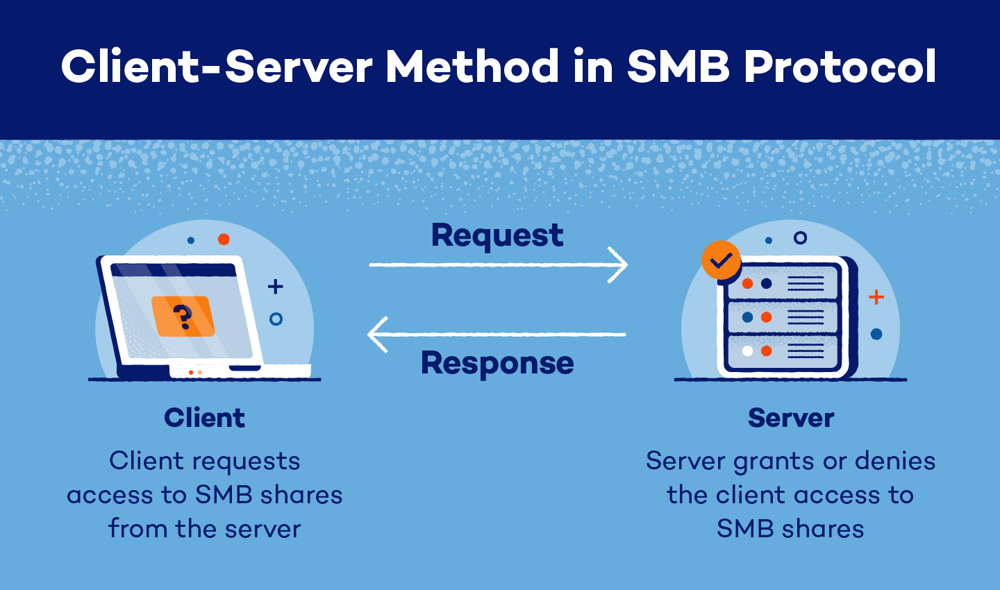

# 🔍 The SMB Enumeration 

> A comprehensive guide to enumerating SMB services on Windows and Samba systems

---

## 📖 Introduction to SMB

**Server Message Block (SMB)** is a network file sharing protocol commonly used for sharing files, printers, and other resources between devices on a network. It is natively supported by Windows and has an implementation called Samba on Linux systems. SMB operates primarily over TCP ports 445 and 139, making it a key focus for security assessments and penetration testing.

Key features of SMB include:
- File and printer sharing
- User authentication
- Resource access control
- Inter-process communication



---

## Initial Enumeration

### 🎯 Quick Start

When you spot TCP 445 on a Windows host, start with:
```bash
netexec smb [ip]
```

This provides essential information including:
- Hostname
- Domain name
- OS version
- SMB version
- SMB signing status

---

## Share Discovery

### 🛠️ Primary Tools

1. **NetExec (formerly CrackMapExec)**
   ```bash
   # With credentials
   netexec smb [host/ip] -u [user] -p [pass] --shares

   # Anonymous/guest access
   netexec smb [host/ip] -u guest -p '' --shares
   ```

2. **SMBClient**
   ```bash
   # Null authentication
   smbclient -N -L //[ip]
   ```

### 💡 Pro Tips
- Always try multiple authentication methods:
  - No credentials (null session)
  - Guest account with blank password
  - Guest account with random password
  - Valid credentials when available

---

## File System Exploration

### 🗂️ Methods

1. **Interactive Browsing**
   ```bash
   # Anonymous access
   smbclient //[ip]/[share] -N

   # Authenticated access
   smbclient //[ip]/[share] -U [username] [password]
   ```

2. **Advanced Enumeration**
   ```bash
   # Spider all shares
   netexec smb -u [user] -p [pass] -M spider_plus

   # Kerberos authentication
   smbclient.py '[domain]/[user]:[pass]@[ip/host] -k -no-pass
   ```

3. **Large-Scale Search**
   ```bash
   manspider.py --threads 256 [IP/CIDR] -u [username] -p [pass] [options]
   ```

---

## User Enumeration

### 👥 RID Cycling

Enumerate users and groups through Security Identifiers (SIDs):

1. **Using Impacket**
   ```bash
   lookupsid.py guest@[ip] -no-pass
   ```

2. **Using NetExec**
   ```bash
   netexec smb [ip] -u guest -p '' --rid-brute
   ```

### 🔍 SAM Remote Protocol

```bash
samrdump.py [domain]/[user]:[pass]@[ip]
```

Provides detailed user information:
- Account status
- Password policies
- Last logon
- Bad password count

---

## Vulnerability Assessment

### 🔒 Security Scanning

```bash
nmap --script smb-vuln* -p 139,445 [ip]
```

Notable vulnerabilities to check:
- MS17-010 (EternalBlue)
- MS08-067
- MS06-025

---

## Special Considerations for Samba

### 🐧 Linux SMB Servers

For Samba servers:
- Version detection is crucial
- Different authentication quirks
- May require specific dialect negotiation

### 🔍 Version Detection

```bash
# Using Nmap
nmap -sV -p 139,445 --script smb-protocols [ip]

# Manual probing
tcpdump + smbclient method for detailed version info
```

---

## 🛠️ Recommended Tools

### Essential Tools

- **NetExec**: Primary enumeration tool
- **SMBClient**: Interactive browsing
- **Impacket Scripts**: Advanced exploitation
- **Nmap**: Vulnerability scanning
- **Manspider**: Large-scale file search

### Installation Commands

```bash
# NetExec
pipx install git+https://github.com/Pennyw0rth/NetExec

# Impacket
pipx install impacket

# Standard tools
apt install smbclient nmap
```

---

## 🏆 Best Practices

1. **Always start broad**
   - Begin with basic enumeration
   - Move to targeted approaches
   - Document everything

2. **Layer your approach**
   - Try anonymous access first
   - Attempt guest account
   - Use credentials when available

3. **Be thorough but careful**
   - Watch for honeypots
   - Monitor for logging
   - Respect rate limits

4. **Document findings**
   - Keep track of shares
   - Note unusual permissions
   - Record version information

---

## ⚠️ Common Pitfalls

- Assuming no access without trying guest account
- Missing null session opportunities
- Overlooking Kerberos authentication options
- Not trying multiple tools for the same task
- Forgetting to check for vulnerabilities

