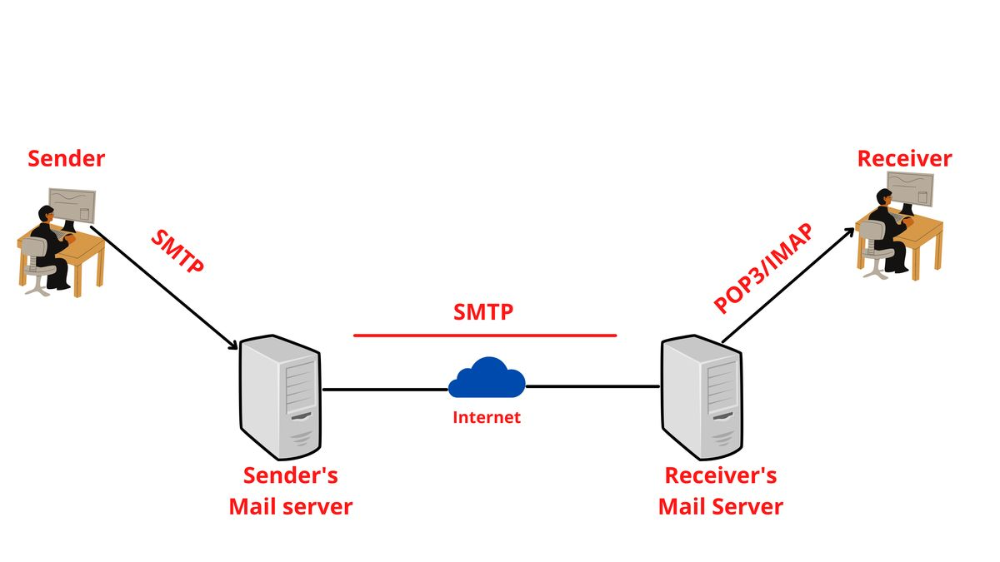

# SMTP Security Testing & Protocol Analysis 

## 🌐 Introduction to SMTP
Simple Mail Transfer Protocol (SMTP) is the backbone of email communication across the internet. Operating on TCP/IP, it facilitates the transmission of electronic mail between servers and clients.



### Key Components
- **MUA (Mail User Agent)**: Email clients like Outlook or Thunderbird
- **MSA (Mail Submission Agent)**: Receives mail from MUA
- **MTA (Mail Transfer Agent)**: Handles server-to-server mail transfer
- **MDA (Mail Delivery Agent)**: Manages local mail delivery

## 🔍 Port Configuration
```
Standard Ports:
- Port 25   : Default SMTP (commonly blocked)
- Port 465  : Legacy SMTPS (deprecated but still used)
- Port 587  : Modern SMTP with STARTTLS (recommended)
- Port 2525 : Alternative SMTP port
```

## 📋 Complete SMTP Commands Table

| S.No. | Keyword | Command Form | Description | Usage |
|-------|---------|--------------|-------------|--------|
| 1. | HELO | HELO<SP><domain><CRLF> | Provides the identification of the sender (host name) | Mandatory |
| 2. | MAIL | MAIL<SP>FROM:<reverse-path><CRLF> | Specifies the originator of the mail | Mandatory |
| 3. | RCPT | RCPT<SP>TO:<forward-path><CRLF> | Specifies the recipient of mail | Mandatory |
| 4. | DATA | DATA<CRLF> | Specifies the beginning of the mail | Mandatory |
| 5. | QUIT | QUIT<CRLF> | Closes the TCP connection | Mandatory |
| 6. | RSET | RSET<CRLF> | Aborts current mail transaction but keeps TCP connection open | Highly recommended |
| 7. | VRFY | VRFY<SP><string><CRLF> | Used to confirm or verify the username | Highly recommended |
| 8. | NOOP | NOOP<CRLF> | No operation | Highly recommended |
| 9. | TURN | TURN<CRLF> | Reverses the role of sender and receiver | Seldom used |
| 10. | EXPN | EXPN<SP><string><CRLF> | Specifies the mailing list to be expanded | Seldom used |
| 11. | HELP | HELP<SP><string><CRLF> | Sends specific documentation to the system | Seldom used |
| 12. | SEND | SEND<SP>FROM:<reverse-path><CRLF> | Sends mail to the terminal | Seldom used |
| 13. | SOML | SOML<SP>FROM:<reverse-path><CRLF> | Sends mail to terminal if possible; otherwise to mailbox | Seldom used |
| 14. | SAML | SAML<SP>FROM:<reverse-path><CRLF> | Sends mail to terminal and mailbox | Seldom used |

## 📊 Complete Protocol Comparison Table

| Feature | SMTP | POP3 | IMAP |
|---------|------|------|------|
| Full Name | Simple Mail Transfer Protocol | Post Office Protocol | Internet Message Access Protocol |
| Primary Use | Used for sending mail | Used for retrieving mail | Used for retrieving mail |
| Protocol Type | it is push protocol | it is pull protocol | it is pull protocol |
| Working Area | It work between sender’s mail server to receiver’s mail server and sender and sender’s mail server | It work between receiver and receiver’s mail server | It works between receiver and receiver’s mail server |
| Storage | It does not store mail on server it just send the mail | It download all the mail when it connected to internet | It store all mail on server and download when it get request to download |
| Default Port | Works on TCP port number 25 | Works on TCP port number 110 | Works on TCP port number 143 |
| Connection Type | Connection oriented protocol | Connection oriented protocol | Connection oriented protocol|
| TCP Connection | It has persistence TCP connection | It has persistence TCP connection | It has persistence TCP connection |
| State Type | Stateless protocol | Stateful protocol | Stateful protocol |
| Protocol Band | It is in band protocol | It is in band protocol | It is in band protocol   |
| Usage Location | Not used at receiver side | Used at receiver side | Used at receiver side |

## 🔄 SMTP vs Extended SMTP Comparison

| SMTP | Extended SMTP |
|------|---------------|
| Users were not verified, leading to spam issues | Authentication of sender is required |
| Cannot attach multimedia files directly without MIME | Can directly attach multimedia files |
| Cannot reduce email size | Can reduce email size |
| Clients open transmission with HELO command | Clients open transmission with EHLO command |
| Basic functionality | Enhanced features and security |

## 🛠️ Security Testing Tools & Techniques

### 1. Reconnaissance Commands
```bash
# Full Nmap SMTP scanning
nmap --script smtp-brute -p 25,465,587 <target-ip>
nmap --script smtp-commands -p 25,465,587 <target-ip>
nmap --script smtp-enum-users -p 25,465,587 <target-ip>
nmap --script smtp-ntlm-info --script-args smtp-ntlm-info.domain=domain.com -p 25,465,587 <target-ip>
nmap --script smtp-vuln-cve2011-1764 -p 25,465,587 <target-ip>
nmap --script smtp-* -p 25,465,587 <target-ip>
```

### 2. User Enumeration Testing
```bash
# VRFY Testing
smtp-user-enum -M VRFY -u <username> -t <target-ip>
smtp-user-enum -M VRFY -U usernames.txt -t <target-ip>

# RCPT Testing
smtp-user-enum -M RCPT -u <username> -t <target-ip>
smtp-user-enum -M RCPT -U usernames.txt -t <target-ip>

# EXPN Testing
smtp-user-enum -M EXPN -u <username> -t <target-ip>
smtp-user-enum -M EXPN -D <hostname> -U usernames.txt -t <target-ip>
```

### 3. STARTTLS Testing
```bash
# Port 25 Testing
openssl s_client -starttls smtp -connect <target-ip>:25

# Port 465 Testing
openssl s_client -crlf -connect <target-ip>:465

# Port 587 Testing
openssl s_client -starttls smtp -crlf -connect <target-ip>:587
```

## 🔐 Security Best Practices

### 1. Server Configuration
- Implement strong authentication
- Enable TLS/SSL encryption
- Configure proper access controls
- Set up rate limiting
- Enable logging and monitoring
- Regular security updates
- Implement SPF, DKIM, and DMARC

### 2. Common Vulnerabilities Prevention
- Disable open relay configuration
- Restrict VRFY and EXPN commands
- Implement proper input validation
- Set maximum message size limits
- Configure timeout values
- Monitor authentication attempts
- Regular security audits

### 3. Monitoring & Logging
- Track authentication failures
- Monitor mail queue size
- Log all SMTP transactions
- Set up alerting for unusual patterns
- Regular log analysis
- Backup logs securely
- Implement log rotation

## 📝 Complete Testing Checklist

### Basic Configuration
- [ ] Port scanning
- [ ] Service version identification
- [ ] SSL/TLS configuration
- [ ] Authentication mechanisms
- [ ] Command restrictions
- [ ] Timeout settings
- [ ] Maximum message size

### Security Features
- [ ] Open relay testing
- [ ] User enumeration vulnerability
- [ ] Authentication bypass attempts
- [ ] Encryption strength
- [ ] Rate limiting effectiveness
- [ ] Access control testing
- [ ] Error handling verification

### Advanced Testing
- [ ] STARTTLS implementation
- [ ] SPF record validation
- [ ] DKIM configuration
- [ ] DMARC policy testing
- [ ] Bounce handling
- [ ] Queue processing
- [ ] Backup MX testing

## 🔍 Common Issues and Solutions

### Authentication Problems
- **Issue**: Failed login attempts
- **Solution**: Verify credentials, check encryption settings
- **Prevention**: Implement strong authentication policies

### Connection Issues
- **Issue**: Cannot connect to SMTP server
- **Solution**: Check firewall rules, verify port settings
- **Prevention**: Regular connectivity testing

### Delivery Problems
- **Issue**: Emails not reaching destination
- **Solution**: Check DNS records, verify routing
- **Prevention**: Implement proper monitoring

## 🚀 Performance Optimization

### Server Optimization
1. Queue Management
   - Regular queue monitoring
   - Proper timeout settings
   - Queue size limits

2. Resource Allocation
   - Adequate memory allocation
   - CPU resource management
   - Disk space monitoring

3. Connection Management
   - Maximum connection limits
   - Connection timeout settings
   - Rate limiting configuration

## 📚 Additional Resources

### Documentation
1. RFCs
   - RFC 5321 (SMTP Protocol)
   - RFC 3207 (SMTP over TLS)
   - RFC 6409 (Message Submission)

### Tools
1. Testing Tools
   - Nmap SMTP scripts
   - smtp-user-enum
   - swaks
   - Metasploit modules

2. Monitoring Tools
   - Nagios
   - Zabbix
   - Prometheus

## 🎯 Conclusion

SMTP security requires a comprehensive approach combining:
1. Regular security testing
2. Proper configuration
3. Continuous monitoring
4. Regular updates
5. Incident response planning
6. Staff training
7. Documentation maintenance
