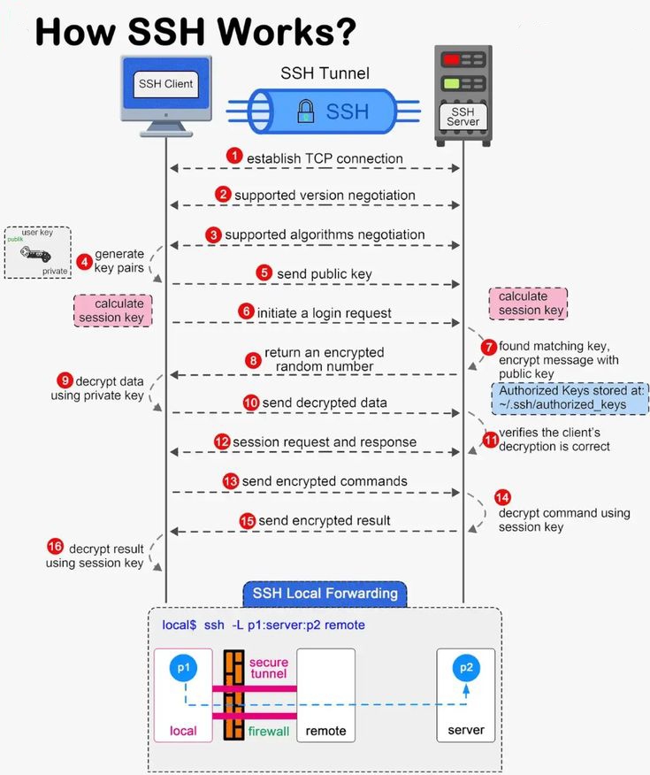
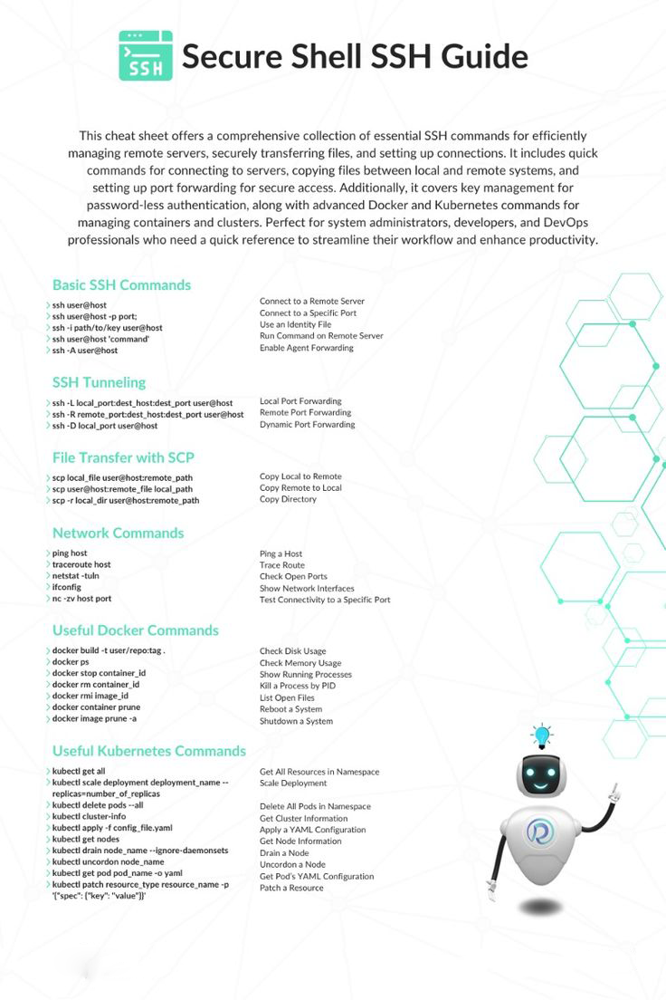

# 🚀 The Complete SSH Bible
> *Your ultimate guide to mastering Secure Shell - from basics to advanced techniques*

---

## 🌟 What is SSH?

### The Basics
SSH (Secure Shell) is like a secret tunnel between computers. Imagine sending letters in unbreakable envelopes - that's SSH! 

```bash
# The most basic SSH command
ssh username@hostname
```

Key Features:
- 🔒 Military-grade encryption
- 🎯 Port 22 by default
- 🔑 Public key authentication
- 🌐 Secure remote access



---

## 🎭 The SSH Trilogy



### 1. SSH Client
```bash
# Connect with different options
ssh -p 2222 user@host          # Custom port
ssh -i key.pem user@host       # Using key file
ssh -v user@host               # Verbose mode
```

### 2. SSH Server (sshd)
```bash
# Common server management
sudo systemctl status sshd     # Check status
sudo systemctl restart sshd    # Restart service
```

### 3. SSH Keys
```bash
# Key management suite
ssh-keygen -t rsa -b 4096     # Generate strong key
ssh-copy-id user@host         # Deploy key to server
```

## 🔐 Authentication Magic

### Password Authentication
```bash
# Traditional login
ssh user@host                 # Will prompt for password
```

### Key-Based Authentication
```bash
# Generate your key pair
ssh-keygen -t rsa -b 4096 -C "your@email.com"

# Key types explained:
# RSA    - The classic choice (4096 bits recommended)
# Ed25519 - The new superhero (modern & secure)
# ECDSA  - The middle ground option
```

## 📦 File Transfer Suite

### SCP (Secure Copy Protocol)
```bash
# File transfer operations
scp local.txt user@host:/path     # Upload
scp user@host:/path/file.txt .    # Download
scp -r folder/ user@host:/path    # Upload directory
```

### SFTP (SSH File Transfer Protocol)
```bash
# Interactive session
sftp user@host

# SFTP commands arsenal
pwd            # Where am I?
ls             # What's here?
get file       # Grab a file
put file       # Send a file
!ls            # Local ls command
```

## 🎯 Advanced SSH Powers

### Port Forwarding
```bash
# Local forwarding (access remote service locally)
ssh -L 8080:localhost:80 user@host

# Remote forwarding (share local service remotely)
ssh -R 8080:localhost:80 user@host

# Dynamic forwarding (SOCKS proxy)
ssh -D 1080 user@host
```

### X11 Forwarding
```bash
# Run GUI applications remotely
ssh -X user@host         # Standard forwarding
ssh -Y user@host         # Trusted forwarding
```

### Jump Hosts
```bash
# Multi-server hopping
ssh -J jump_host final_host
ssh -J user@hop1,user@hop2 destination
```

## ⚙️ Configuration Mastery

### SSH Config File
```bash
# ~/.ssh/config
Host myserver
    HostName 192.168.1.100
    User admin
    Port 2222
    IdentityFile ~/.ssh/special_key
    ForwardAgent yes

# Use it simply as:
ssh myserver
```

### Server Configuration
```bash
# /etc/ssh/sshd_config
Port 2222
PermitRootLogin no
PasswordAuthentication no
MaxAuthTries 3
```

## 🛡️ Security Fortress

### Best Practices
1. **Key Security**
   ```bash
   # Protect your keys
   chmod 600 ~/.ssh/id_rsa
   chmod 700 ~/.ssh
   ```

2. **Server Hardening**
   ```bash
   # Disable unused features
   AllowTcpForwarding no
   X11Forwarding no
   MaxStartups 5:50:10
   ```

3. **Access Control**
   ```bash
   # Restrict user access
   AllowUsers admin maintainer
   DenyUsers baduser
   ```

## 🔧 Troubleshooting Guide

### Common Issues
1. **Connection Refused**
   ```bash
   # Check server status
   systemctl status sshd
   
   # Check firewall
   sudo ufw status
   ```

2. **Key Problems**
   ```bash
   # Debug connection
   ssh -vvv user@host
   
   # Check permissions
   ls -la ~/.ssh/
   ```

3. **Known Hosts Issues**
   ```bash
   # Remove problematic entry
   ssh-keygen -R hostname
   ```

## 🎨 Creative Use Cases

### Reverse Shell
```bash
# Create reverse shell (use responsibly!)
ssh -R 19999:localhost:22 user@remote
```

### File Synchronization
```bash
# Sync directories
rsync -avz -e ssh /local/path/ user@host:/remote/path/
```

### Database Tunnel
```bash
# Access remote database locally
ssh -L 3306:localhost:3306 user@database-server
```

## 📈 Performance Tips

### Connection Optimization
```bash
# Speed up connections
Host *
    ControlMaster auto
    ControlPath ~/.ssh/control/%r@%h:%p
    ControlPersist 1h
```

### Compression
```bash
# Enable compression for slow connections
ssh -C user@host
```

## SSH Environment

### Essential Files
```plaintext
~/.ssh/                    # Your SSH home
├── config                 # Your config file
├── known_hosts           # Servers you trust
├── authorized_keys       # Keys that can log in
├── id_rsa               # Your private key
└── id_rsa.pub           # Your public key
```

### Process Management
```bash
# View connections
ps aux | grep ssh

# Kill specific connection
kill <PID>
```

Remember:
- 🔒 Always use strong keys
- 🔄 Regularly update configurations
- 📝 Keep logs for auditing
- 🚫 Never share private keys
- ⏰ Rotate keys periodically
