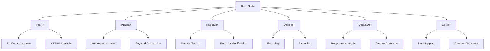
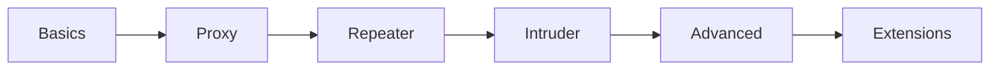

# 🛡️ Burp Suite: The Art of Web Penetration Testing
---

## 🌊 Ocean of Tools



---

## 🎯 Core Components

### 1️⃣ Proxy: Your Traffic Control Tower
```
🔄 Traffic Flow
├── Browser ──► Burp Proxy (127.0.0.1:8080)
├── Request Interception
├── Response Analysis
└── SSL/TLS Handling
```

### 2️⃣ Intruder: The Automated Arsenal
```
🚀 Attack Types
├── Sniper (Single position)
├── Battering Ram (Same payload)
├── Pitchfork (Multiple positions)
└── Cluster Bomb (All combinations)
```

### 3️⃣ Repeater: The Request Laboratory
```
🔬 Features
├── Request Modification
├── Response Analysis
├── History Tracking
└── Parameter Testing
```

### 4️⃣ Decoder: The Crypto Station
```
🔐 Transformations
├── Base64
├── URL Encoding
├── HTML Entities
└── Custom Algorithms
```

---

## 🛠️ Setup & Configuration

### Proxy Configuration
```terminal
┌──(burp㉿suite)
└─$ Browser Settings
   ├── Proxy: 127.0.0.1
   └── Port: 8080
```

### SSL Certificate
```terminal
┌──(burp㉿suite)
└─$ Install Burp CA Certificate
   ├── Navigate to http://burp
   └── Download & Install CA
```

---

## 💫 Advanced Features

### 🎨 Custom Extensions
```python
# Example Extension Structure
from burp import IBurpExtender

class BurpExtender(IBurpExtender):
    def registerExtenderCallbacks(self, callbacks):
        # Extension logic here
        pass
```

### 🎯 Scanning Profiles
```
📊 Scan Configurations
├── Active Scanning
├── Passive Analysis
├── Custom Rules
└── Vulnerability Checks
```

---

## 🚀 Professional Workflow

### 1. Reconnaissance
```
🔍 Initial Analysis
├── Spider Crawl
├── Site Mapping
└── Asset Discovery
```

### 2. Testing Phase
```
⚡ Active Testing
├── Proxy Interception
├── Request Manipulation
├── Automated Attacks
└── Manual Testing
```

### 3. Validation
```
✅ Result Analysis
├── Finding Verification
├── Impact Assessment
├── Documentation
└── Reporting
```

---

## 💡 Pro Tips & Tricks

### 🎯 Optimization Tips
- Use scope settings to focus testing
- Create custom scan profiles
- Leverage match/replace rules
- Master keyboard shortcuts

### ⚡ Performance Boosters
```
🚀 Speed Optimization
├── Resource Pool Size
├── Thread Management
├── Response Handling
└── Memory Allocation
```

---

## 📊 Feature Matrix

| Tool | Purpose | Skill Level | Usage |
|------|---------|-------------|--------|
| Proxy | Traffic Analysis | Beginner | High |
| Intruder | Automated Testing | Intermediate | High |
| Repeater | Manual Testing | Beginner | Very High |
| Decoder | Data Transform | Beginner | Medium |
| Comparer | Response Analysis | Intermediate | Medium |
| Spider | Site Mapping | Beginner | High |

---

## 🎓 Learning Path



---

## 🛡️ Best Practices

### Security Testing
- ✅ Define clear scope
- ✅ Document all tests
- ✅ Maintain session logs
- ✅ Regular reporting
- ✅ Follow ethics

### Tool Usage
- ✅ Regular updates
- ✅ Backup configurations
- ✅ Custom shortcuts
- ✅ Resource management

---

## 🔮 Advanced Scenarios

### API Testing
```terminal
# Custom Header Testing
GET /api/v1/users HTTP/1.1
Host: target.com
X-Custom-Header: {{payload}}
```

### Authentication Bypass
```terminal
# Token Manipulation
POST /auth HTTP/1.1
Content-Type: application/json
{"token": "FUZZ_HERE"}
```

---

*⚠️ Note: Always use Burp Suite ethically and with proper authorization.*