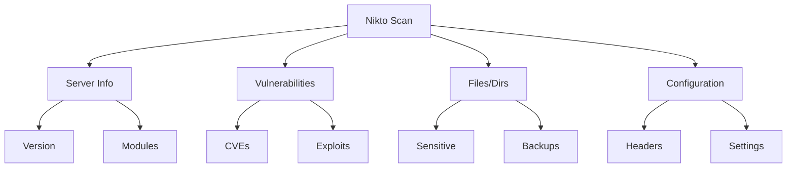

# 🛡️ Nikto: Advanced Web Server Security Scanner
---

## 🔍 Overview

Nikto is a powerful open-source web server security scanner that acts as your digital security guard, identifying vulnerabilities and misconfigurations. Essential for:
- Security Assessments
- Penetration Testing
- Compliance Verification
- Server Hardening

---

## ⚡ Core Features

```
🔒 Security Analysis
├── Server Fingerprinting
├── Vulnerability Detection
├── Configuration Audit
└── Compliance Checking
```

### 📊 Scan Coverage



---

## 🛠️ Command Arsenal

### 1. Basic Reconnaissance
```terminal
┌──(security㉿audit)
└─$ nikto -h http://example.com
```

### 2. Port Specification
```terminal
┌──(security㉿audit)
└─$ nikto -h http://example.com -p 8080
```

### 3. Secure Protocol
```terminal
┌──(security㉿audit)
└─$ nikto -h https://example.com
```

### 4. Proxy Integration
```terminal
┌──(security㉿audit)
└─$ nikto -h http://example.com -useproxy http://proxy:port
```

---

## 📋 Output Analysis

| Element | Description | Importance |
|---------|-------------|------------|
| 🖥️ Server Info | Version & Type | High |
| ⚠️ Vulnerabilities | CVE References | Critical |
| 📁 Directories | Sensitive Paths | High |
| ⚙️ Configuration | Server Settings | Medium |

---

## 🎯 Use Case Scenarios

### 1️⃣ Vulnerability Assessment
```terminal
# Comprehensive scan with SSL
nikto -h https://target.com -ssl -Tuning 123bcd
```

### 2️⃣ Compliance Testing
```terminal
# Detailed output for compliance
nikto -h target.com -Format htm -o compliance_report.html
```

### 3️⃣ Stealth Scanning
```terminal
# Reduced footprint scan
nikto -h target.com -Tuning light
```

---

## 🚀 Advanced Options

### Scan Tuning
```
🎛️ Tuning Options
├── 1 (File Upload)
├── 2 (Misconfiguration)
├── 3 (Information Disclosure)
├── 4 (Injection)
└── 5 (Remote File Retrieval)
```

### Output Formats
```terminal
# HTML Report
nikto -h target.com -Format htm -o report.html

# CSV Format
nikto -h target.com -Format csv -o report.csv

# XML Output
nikto -h target.com -Format xml -o report.xml
```

---

## 💡 Pro Tips

### 🎯 Optimization
- Start with basic scans
- Gradually increase complexity
- Use appropriate tuning options
- Monitor scan impact

### 🛡️ Best Practices
```
✅ Verify target scope
✅ Document findings
✅ Regular updates
✅ Follow security policies
```

---

## ⚙️ Quick Reference

### Common Commands
```terminal
# Basic scan
nikto -h target.com

# SSL scan with custom port
nikto -h target.com -ssl -p 8443

# Save output
nikto -h target.com -output scan.txt
```

### Scan Options
| Flag | Purpose | Example |
|------|----------|---------|
| -h | Host target | `-h target.com` |
| -p | Port specification | `-p 8080` |
| -ssl | Enable SSL/TLS | `-ssl` |
| -Tuning | Scan optimization | `-Tuning 1234` |

---

## 🔰 Getting Started

1. **Installation**
   ```terminal
   git clone https://github.com/sullo/nikto
   cd nikto/program
   ```

2. **Update Database**
   ```terminal
   nikto -update
   ```

3. **First Scan**
   ```terminal
   nikto -h target.com -Format txt -o first_scan.txt
   ```

---

## 📊 Scan Workflow

```
Target Selection → Initial Scan → Analysis
         ↓            ↓            ↓
    Validation → Deep Scan → Report Generation
         ↓            ↓            ↓
    Risk Assessment → Findings → Remediation
```

---

*⚠️ Note: Always ensure you have proper authorization before scanning any target.*