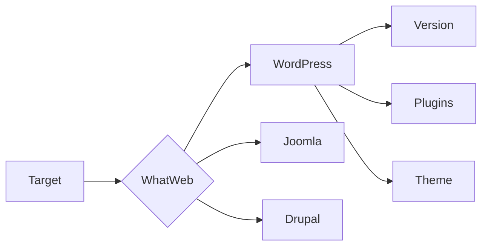

# 🌐 WhatWeb: Web Technology Intelligence Tool
---

## 🎯 Overview

WhatWeb is a sophisticated web reconnaissance tool that acts as your digital detective, uncovering the technological DNA of websites. Used by security professionals worldwide for:
- Penetration Testing
- Security Assessment
- Technology Stack Analysis
- Infrastructure Mapping

---

## 🔍 Core Capabilities

### 1️⃣ Technology Detection Matrix

```
Website ─────┬─── 📦 CMS Systems
            ├─── 🖥️ Web Servers
            ├─── ⚡ Frameworks
            ├─── 📜 Languages
            └─── 🔒 Security Config
```

### 2️⃣ Plugin Ecosystem
```
🔌 1800+ Active Plugins
  │
  ├── CMS Detectors
  ├── Server Identifiers
  ├── Framework Analyzers
  ├── Security Scanners
  └── Custom Modules
```

---

## 🛠️ Command Arsenal

### Basic Scan
```terminal
┌──(recon㉿kali)
└─$ whatweb https://example.com
```

### Aggression Levels
```terminal
┌──(recon㉿kali)
└─$ whatweb -a <level> https://target.com
```

| Level | 🎯 Purpose | 🔊 Noise |
|-------|-----------|----------|
| 1 | Stealth Mode | Minimal |
| 3 | Standard Scan | Moderate |
| 5 | Deep Analysis | High |

---

## 📊 Output Formats

### Terminal Output
```terminal
┌──(recon㉿kali)
└─$ whatweb --log-brief=scan.txt website.com
```

### Detailed JSON
```terminal
┌──(recon㉿kali)
└─$ whatweb --log-json=scan.json website.com
```

### XML Format
```terminal
┌──(recon㉿kali)
└─$ whatweb --log-xml=scan.xml website.com
```

---

## 🎨 Advanced Features

### 🕵️ Stealth Mode
```terminal
# Minimal footprint scan
whatweb -a 1 --no-errors target.com
```

### 🚀 Aggressive Mode
```terminal
# Deep reconnaissance
whatweb -a 3 --follow-redirect target.com
```

### 📝 Custom Headers
```terminal
# Add custom user agent
whatweb --user-agent "Custom-Scanner" target.com
```

---

## 🎯 Use Case Scenarios

### 1. CMS Investigation


### 2. Security Assessment
```
🔒 SSL/TLS Analysis
├── Protocol Versions
├── Cipher Suites
├── Certificate Info
└── Security Headers
```

---

## 💡 Pro Tips

### Performance Optimization
- 🚀 Use appropriate aggression levels
- 🕒 Schedule scans during off-peak hours
- 📊 Log outputs for analysis
- 🔄 Regular plugin updates

### Best Practices
- ✅ Start with stealth mode
- ✅ Gradually increase aggression
- ✅ Document findings
- ✅ Verify results manually

---

## ⚙️ Quick Reference

### Common Commands
```terminal
# Basic scan
whatweb example.com

# Aggressive scan with logging
whatweb -a 3 --log-json=scan.json example.com

# Multiple targets
whatweb -i targets.txt --log-brief output.txt
```

### Plugin Usage
```terminal
# List all plugins
whatweb --list-plugins

# Use specific plugins
whatweb --plugins=wordpress,joomla target.com
```

---

## 🔰 Getting Started

1. **Installation**
   ```terminal
   git clone https://github.com/urbanadventurer/WhatWeb.git
   cd WhatWeb
   bundle install
   ```

2. **First Scan**
   ```terminal
   whatweb -v example.com
   ```

3. **View Results**
   ```terminal
   whatweb --log-verbose=results.txt example.com
   ```

---

*⚠️ Note: Always ensure you have proper authorization before scanning any target.*